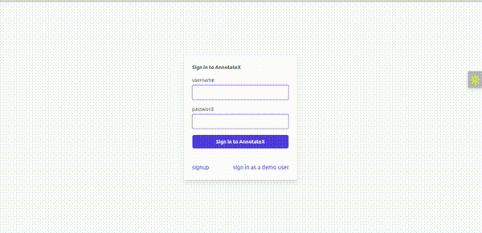

# 🖍️ annotate-x-express

**annotate-x-express** is a full-stack web application that enables users to **annotate images with bounding boxes** and **export the labeled datasets in COCO format** — ideal for training computer vision models.

**NOTE**: The pattern (unit of work, repository and service layer patterns) used in this project is a bit verbose and an overkill for the current stage of the project. It was used for learning purpose and for probable future features for scalability and maintainability.


🔗 [website](https://annotate-x.onrender.com) · [GitHub Repo](https://github.com/daniell-olaitan/annotate-x-express)

---

## 📸 Demo 



---

## 📌 Project Overview

**annotate-x-express** is designed for data scientists, machine learning engineers, and researchers who need to prepare datasets for object detection tasks. The app allows users to:

- Upload and annotate images using bounding boxes
- View and edit annotations
- Export labeled data in **COCO JSON** format
- Manage annotation sessions easily via a clean UI

---

## ✨ Features

- 🖼️ Upload multiple images for annotation
- ✍️ Draw, resize, and move bounding boxes on each image
- 🧠 Label each annotation with a class name
- 📤 Export labeled datasets in **COCO format**
- 🔐 User-friendly and responsive interface

---

## ⚙️ Tech Stack

| Category     | Technologies                                         |
|--------------|------------------------------------------------------|
| Backend      | TypeScript, ExpressJs, NodeJs, PostgreSQL, Prisma ORM|
| Frontend     | Preact, Tailwind CSS, JavaScript, EJS, HTML          |

---

## 📂 Export Format

Annotations are exported in the widely-used **COCO format**, compatible with many popular machine learning frameworks such as TensorFlow and PyTorch.

---

## Installation and Setup

### Step-by-Step Setup

1. **Clone the repository**:

   ```bash
   git clone https://github.com/daniell-olaitan/annotate-x-express.git
   cd annotate-x-express
   ```

2. **Set up environment variables**:

   * Copy the sample `.env` file and fill in the required variables.

   ```bash
   cp .env.sample .env
   ```

3. **Install dependencies**:

   ```bash
   npm install
   ```

4. **Build the TypeScript project**:

   ```bash
   npm run build
   ```

5. **Run the project**:

   ```bash
   npm start
   ```

> 💡 For development:

```bash
npm run dev
```

## ✅ License

This project is open-source under the MIT License.

```
